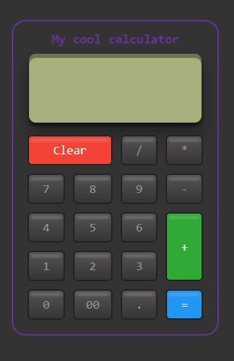

# Calculator Project

This repository contains a basic calculator project built using HTML and vanilla CSS.



## Features

- Addition, subtraction, multiplication, and division operations
- Clear button to reset the calculator
- Responsive design for various screen sizes

## Getting Started

To get a local copy of the project up and running, follow these steps:

1. Clone the repository to your local machine using the following command:

   ```shell
   git clone https://github.com/your-username/calculator-project.git

Acknowledgments
The calculator design is inspired by various online resources and modified for this project.
Feel free to explore, modify, and use this calculator project to meet your needs. If you encounter any issues or have suggestions for improvement, please create an issue in the repository.
